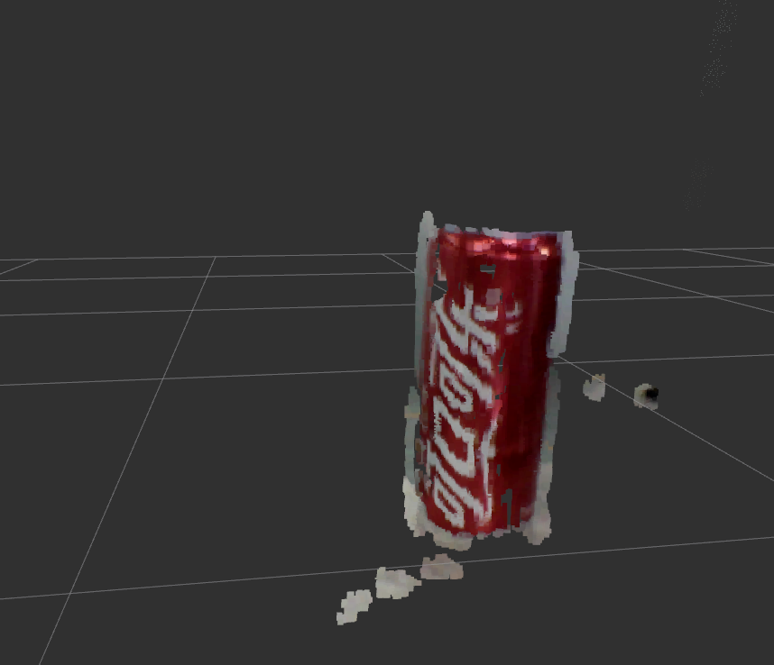
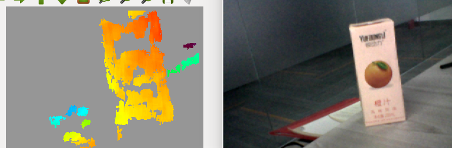

# Chusei 3d webcam ros package


dependency:
```
sudo apt install uvcdynctrl
```
if calibration needed:
> http://wiki.ros.org/camera_calibration/Tutorials/StereoCalibration
```
rosrun camera_calibration cameracalibrator.py --approximate 0.1 --size 8x6 --square 0.027 --no-service-check right:=/stereo/right/image_raw left:=/stereo/left/image_raw right_camera:=/stereo/right left_camera:=/stereo/left
```
normal stereo:
```
 roslaunch little_stereo_camera stereo.launch
```
with depth:
> http://wiki.ros.org/stereo_image_proc
```
ROS_NAMESPACE=stereo rosrun stereo_image_proctereo_image_proc
```


>run rqt reconfigure for disparity map's dynamic reconfiguration

disparity map:
```
rosrun image_view disparity_view image:=/stereo/disparity
```

3d scene

